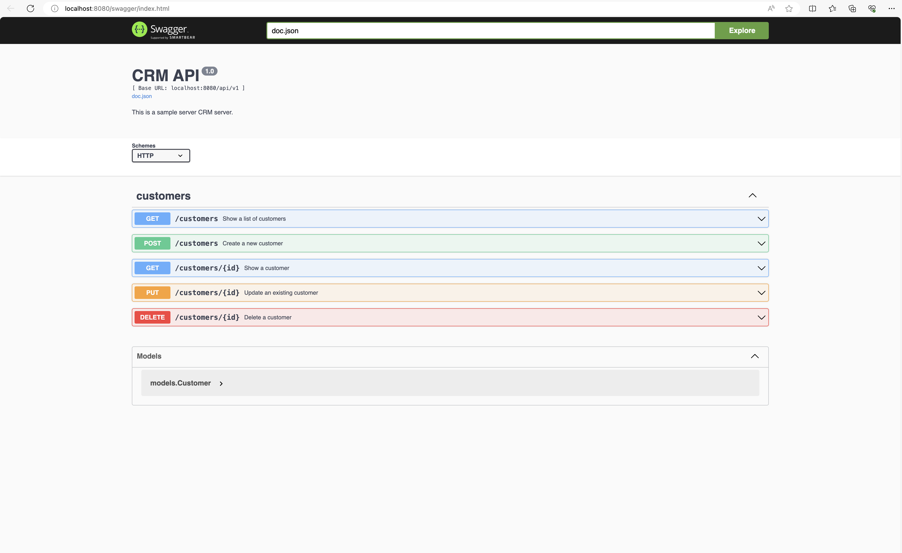

# CRM Backend API - Udacity Nanodegree

This is the backend API for the CRM project. It is built using go and the gorilla/mux router.

## Getting Started

To get started, you will need to have go installed on your machine. You can download it from [here](https://golang.org/dl/).

Once you have go installed, you can clone the repository and run the following command to start the server:

```bash
go run main.go
```

This will start the server on port 8080. You can then access the API at `http://localhost:8080`.

## API Endpoints

The API has the following endpoints:

- GET api/v1/customers - Get all customers
- GET api/v1/customers/{id} - Get a customer by id
- POST api/v1/customers - Create a new customer
- PUT api/v1/customers/{id} - Update a customer by id
- DELETE api/v1/customers/{id} - Delete a customer by id

## Docker Image

To build the docker image, you can run the following command:

```bash
docker build -t crm-api:latest .
```

To run the docker image, you can run the following command:

```bash
docker run -d -p 8080:8080 crm-api
```

## Running Tests

To run the tests, you can run the following command:
Test Controller

```bash
go test ./controllers
```

Test Service

```bash
go test ./services
```

## Database

Project using data imported from a customers.json file. The file is located in the data folder.

ReadData() function reads the data from the file and returns a slice of Customer objects in Services package.

Screenshot of the test results

